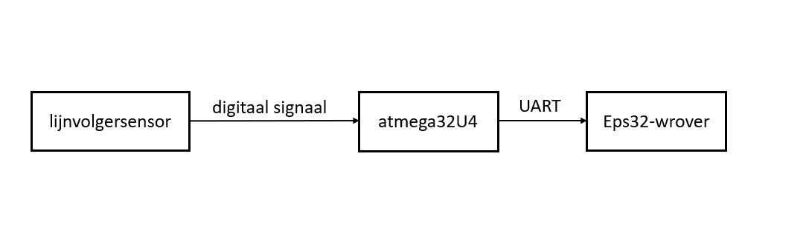
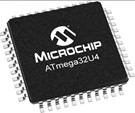

# ROBOTWAGEN

##  Probleemstelling

De studenten van de eerste jaar moeten als opdracht de robotwagen gaan programmeren. Maar momenteel zijn er weinig robotwagens beschikbaar waardoor niet alle studenten de kans krijgen om die robotwagen te kunnen besturen. Daarom ga ik en de andere studenten van de tweede jaar individueel deze robotwagen als opdracht gaan bouwen. Daarnaast moeten we ook de bestaande versie van de wagen verbeteren en compacter maken. 
Op het einde van dit project moet onze robotwagen in staat zijn om manueel bestuurd te kunnen worden en automatisch te kunnen rijden door een lijn te volgen.

Hieronder vindt u de probleemstelling opgedeeld in verschillende delen:
<ul>
    <li>Welke delen van de robotwagen kunnen we verbeteren ?</li>
    <li>Welke nieuwe functies kunnen we toevoegen ?</li>
    <li>Hoe kunnen we deze wagen gebruiksvriendelijk maken voor de eerstejaars ?</li>
    <li>Welke nieuwe sensoren moeten we bijplaatsen ?</li>
    <li>Op welke manier kunnen we de wagen manueel besturen ?</li>
    <li>Hebben we een interface nodig ?</li>
</ul>

##  Mindmap

Hieronder vindt u een mindmap.

## Specifieke analyse
Op de pcb board van de robotwagen zal er een aan uit knop gemonteerd staan. Waanneer de knop aangezet wordt dan kan ik kiezen of de auto ofwel in een manueel mode staat of in een automatische mode zetten. Deze keuze kan bevestigd worden op een website die op Node-RED gebaseerd is. Wanneer er iets op de website een knop gedrukt wordt, krijgt de esp32 een mqtt-bericht. Deze mqtt-bericht bevat dan de commando die de gebruiker gekozen heeft. In dit project is de esp32 module het hart van de robotwagen.  
Bij de manueel mode kan ik de auto in acht richtingen laten rijden namelijk vooruit, links, rechts, achteruit, schuin links, schuin rechts, schuin links achteruit en schuin rechts achteruit. Deze motoren worden door de motor driver bestuurd. Deze motor driver wordt dan door de esp32 bestuurd. Bovendien, elke maneuver je ook doet, komt op het oled-scherm tevoorschijn. Onze oled-scherm maakt gebruik van I²C interface. Dit wil zeggen dat er een seriële communicatie gebeurt tussen de esp32 en het oled-scherm. Daarnaast zie je ook op het scherm dat hoeveel procent batterij je nog over hebt. 
Wanneer de auto in een automatische modus staat, dan zal de auto zichzelf eerst kalibreren. In deze modus zal de wagen de zwart lijn op de bodem zo goed mogelijk proberen te volgen. Deze lijn wordt gemeten door de acht kanaal ’s lijnvolgersensor. Om ervoor te zorgen dat er niet alle pinnen van de esp32 op geraken, plaatsen we tussen de eps32 en de lijnvolgersensor een atmega32U4. Dit is ook net als de esp32 een microcontroller. Deze microcontroller ontvangt de data van de lijn volger en stuurt door naar de esp32 met UART communicatie. Ook zijn er twee afstandssensoren op de wagen gemonteerd. De ene sensor is een ultrasonisch sensor en gebruikt geluid signalen om te meten hoe ver de object is. Deze sensor is zeer geschikt om de lange afstanden te meten. De andere sensor is een ir-afstand sensor. Deze sensor is meer geschikt voor korte afstanden te meten.  De wagen kan deze beide sensoren gebruiken om het object in zijn weg  staat te ontwijken. Deze twee sensoren zijn verbonden mij de esp32.
Om mijn robot te gaan voeden maak ik gebruik van een lipo batterij. Lipo batterijen zijn ook minder zwaar dan andere soort batterijen.

## Hardware analyse

In dit deel van de analyse ga ik de hardware gedeelte van dit project bespreken. Daarnaast wordt er ook aandacht besteed aan de aangelegde connecties tussen de verschillende componenten. Om deze zaken duidelijk voor te stellen maken we gebruik van de blokdiagrammen.

### Hardware blokdiagram

Ik ga de blokdiagram in kleine aparte stukken verdelen. Op het einde zal ik dan alle stukken samenbrengen. Op deze manier heb ik alle stukken apart besproken.

#### Lijnvolgersensor

| Naam                                                                                                | specificaties                                                                                                                                                                                                                                                                             | argumentatie                                                                                                                                               | alternatieven     |
| :-------------------------------------------------------------------------------------------------- | :---------------------------------------------------------------------------------------------------------------------------------------------------------------------------------------------------------------------------------------------------------------------------------------- | :--------------------------------------------------------------------------------------------------------------------------------------------------------- | :---------------- |
| Lijnvolersensor   (Pololu QTR-8RC)    | - $U_{in} = 3.3V - 5V$   - $I_{in} = 100mA$   - dimenties = 2.95 mm x 0.50 mm                                                                                                                                                                                                       | De opdrachtgever gaf immers aan dat deze component gebruikt moet worden.                                                                                   | Amperka Octoliner |
| Microcontroller   (Atmega32U4)              | - $U_{in} = 2.7V - 5.5V$   - $I_{in} = 200mA$   - CPU snelheid: 16MHz   - I/O poorten: 23   - PWM Channels: 8   - ADC Channels: 12   - Serial connectivieit: <ul><li>2 x SPI</li><li>1 x I²C</li><li>1 x UART</li><li>1 x USART</li><li>1 x USB</li></ul>               | Deze microcontroller heeft voldoende pinnen om de lijnvolger sensor te bedienen met een ADMUX register. Ook is deze microcontroller op school beschikbaar. | Atmega328p        |
| Microcontroller   (esp32-wrover)        | - $U_{in} = 2.3V -3.6V$   - $I_{in} = 80mA$   - ROM: 448 KB   - SRAM : 520 KB   - Wi-Fi: 802.11 b/g/n connectiviteit   - Bluetooth 4.2   - ADC channels: 16   - I/O pins: 26   - Serial connectivieit: <ul><li>SPI</li><li>I²C</li><li>I²S</li><li>UART</li></ul> | De esp32 bevat de wifi mogelijkheden. Zo kunnen makkelijk een verbinding maken met de Node-RED website.                                                    | esp32-wroom       |

#### Motor driver

| Naam                                                                                            | specificaties                                                                                                                                                                                                                                                                             | argumentatie                                                                                            | alternatieven |
| :---------------------------------------------------------------------------------------------- | :---------------------------------------------------------------------------------------------------------------------------------------------------------------------------------------------------------------------------------------------------------------------------------------- | :------------------------------------------------------------------------------------------------------ | :------------ |
| Motor driver (TC78H621FNG(O,EL))       | - $U_{in} = 2.7V - 5.5V$   - $I_{out} = 0.8A$   - Aantal motoren = 2                                                                                                                                                                                                                | De opdrachtgever gaf immers aan dat deze component gebruikt moet worden.                                | geen          |
| Motor links en motor rechts                      | - $I_{in} = 700mA$                                                                                                                                                                                                                                                                        | We krijgen deze motor van de lector.                                                                    | geen          |
| Microcontroller   (esp32-wrover)    | - $U_{in} = 2.3V -3.6V$   - $I_{in} = 80mA$   - ROM: 448 KB   - SRAM : 520 KB   - Wi-Fi: 802.11 b/g/n connectiviteit   - Bluetooth 4.2   - ADC channels: 16   - I/O pins: 26   - Serial connectivieit: <ul><li>SPI</li><li>I²C</li><li>I²S</li><li>UART</li></ul> | De esp32 bevat de wifi mogelijkheden. Zo kunnen makkelijk een verbinding maken met de Node-RED website. | esp32-wroom   |

#### OLED-display

| Naam                                                                                                        | specificaties                                                                                                                                                                                                                                                                             | argumentatie                                                                                                        | alternatieven                |
| :---------------------------------------------------------------------------------------------------------- | :---------------------------------------------------------------------------------------------------------------------------------------------------------------------------------------------------------------------------------------------------------------------------------------- | :------------------------------------------------------------------------------------------------------------------ | :--------------------------- |
| OLED-scherm   (OLED Display 128*64 Pixels Wit)    | - $U_{in} = 3.3V of 5V$   - Afmetingen: 27,8 x 27.3 x 4.3mm (d x h x b)   - Serial connectivieit: <ul><li>1 x SPI</li><li>1 x I²C</li></ul>                                                                                                                                         | Deze heeft een spi en een I²C conectiviteit. Daarnast gaf de lector ook aan dat we deze component moeten gebruiken. | SSD1306, Hitachi HD44780 lcd |
| Microcontroller   (esp32-wrover)               | - $U_{in} = 2.3V -3.6V$   - $I_{in} = 80mA$   - ROM: 448 KB   - SRAM : 520 KB   - Wi-Fi: 802.11 b/g/n connectiviteit   - Bluetooth 4.2   - ADC channels: 16   - I/O pins: 26   - Serial connectivieit: <ul><li>SPI</li><li>I²C</li><li>I²S</li><li>UART</li></ul> | De esp32 bevat de wifi mogelijkheden. Zo kunnen makkelijk een verbinding maken met de Node-RED website.             | esp32-wroom                  |

#### Afstandssensoren

| Naam                                                                                                 | specificaties                                                                                                                                                                                                                                                                             | argumentatie                                                                                            | alternatieven |
| :--------------------------------------------------------------------------------------------------- | :---------------------------------------------------------------------------------------------------------------------------------------------------------------------------------------------------------------------------------------------------------------------------------------- | :------------------------------------------------------------------------------------------------------ | :------------ |
| ultrasoon sensor (HC-SR04)      | - $U_{in} = 5V$ - $I_{in} = 15mA$  - max afstand = 4 m - min afstand = 2 cm                                                                                                                                                                                                     | Deze sensor is best voor lange afstanden en is ook beschikbaar op school.                               | geen          |
| IR-sensor   (GP2Y0A02YK0F)                     | - $U_{in} = 4.5V-5.5V$   - max afstand = 150 cm   - min afstand = 20 cm                                                                                                                                                                                                             | Deze sensor is best voor korte afstanden en is ook beschikbaar op school.                               | geen          |
| Microcontroller   (esp32-wrover)        | - $U_{in} = 2.3V -3.6V$   - $I_{in} = 80mA$   - ROM: 448 KB   - SRAM : 520 KB   - Wi-Fi: 802.11 b/g/n connectiviteit   - Bluetooth 4.2   - ADC channels: 16   - I/O pins: 26   - Serial connectivieit: <ul><li>SPI</li><li>I²C</li><li>I²S</li><li>UART</li></ul> | De esp32 bevat de wifi mogelijkheden. Zo kunnen makkelijk een verbinding maken met de Node-RED website. | esp32-wroom   |

#### Interface

Om een Node-RED website te laten runnen zullen we een internet verbinding en een smartphone/ laptop nodig hebben. In de eerste fase zullen we aantal tests uitvoeren op een local netwerk. Die locaal netwerk kunnen bekomen door een broker (mosquitto) op een laptop of op een Raspberry Pi te installeren. 

#### Alles samen

#### Andere componenten
Er zijn ook nog andere belangerijke componenten die in de pcb's gebruikt zullen worden. Hieronder vindt u meer informatie daarover.

| Naam                              |
| :-------------------------------- |
| usb-c connector                   |
| usb naar uart interface (cp2102N) |
| weerstanden                       |
| condensatoren                     |
| diodes                            |
| voltage regualtors                |

## Software analyse

In dit deel van het project analyse wordt de datamigratie en de datastomen geanalyseerd. 

### Data In -en Outputs

De volgende tabel toont de data-uitwisselingen van de verschillende componenten.

| Blok                        | Data In                                       | Data Uit                                           |
| :-------------------------- | :-------------------------------------------- | :------------------------------------------------- |
| Esp32-wrover                | MQTT-berichten ontvangen via Node-RED website | MQTT-berichten ontvangen en juiste actie uitvoeren |
| OLED-scherm                 | I²C signal van de esp32                       | niet van toepassing                                |
| Lijnvolgersensor            | Data van de omgeving                          | Digitaal signaal naar de atmega32U4                |
| Atmega32U4                  | Digital signaal van lijnvolgersensor          | Data doorsturen via UART naar esp32                |
| Motor links en motor rechts | PWM signaal van de motor driver               | Niet van toepassing                                |
| Motor driver                | PWM signaal van esp32                         | PWM signaal naar de motoren                        |
| IR-sensor                   | Data van de omgeving                          | Analoog signaal naar de esp32                      |
| Ultrasoon sensor            | Data van de omgeving                          | Analoog signaal naar de esp32                      |
| Dashboard                   | Json data of MQTT-berichten                   | MQTT-berichten naar de esp32                       |

### Flowchart

Hieronder vindt u de flowchart die het proces van de code uitlegt. Om de flowchart leesbaar en makkelijk begrijpbaar te maken , heb ik de flowchart zo eenvoudig mogelijk gehouden.

### Mockup

Zoals eerder aangehaald, gebruiken we Noder-RED interface om met de wagen te communiceren. Deze interface is een webpagina. De communicatie gebeurt met MQTT-berichten. De volgende afbeelding geeft een beeld over hoe de interface eruit zal zien.

Deze mockup werd gemaakt met behulp van Node-RED nodes. Hieronder vindt u een een afbeelding die de nodes weergeeft.

## Planning

Hieronder vindt u de planning van het tweede semester. Tijdens het uitvoeren van het project 
kunnen er nog altijd wijzigingen aangebracht worden in de planning.

## Rapport

De finale versie van de pcb's moesten we eerst op school laten frezen. Op deze manier maken we eerst een prototype en kunnen we de pcb's op fouten testen. Aan die fouten kunnen we dan een verbetering aanbrengen. Na het frezen heb ik de componenten op de pcb's gesoldeerd. Het solderen was niet zo zeer gemakkelijk aangezien er geen soldeereilandjes beschikbaar waren op de pcb's. Dat wil ook zeggen dat we nu een through hole component zowel aan de bovenste laag en onderste laag moeten solderen. Een andere moeilijkheid was dat pinnen van sommige componenten zeer klein en dichter bij zaten zoals de usb c en de USB-UART chip waardoor tijdens het solderen de pinnen makkelijk met elkaar verbonden werden.

Toch heb ik de meeste componenten kunnen solderen behalve de usb c. De ucb c is onmogelijk om te solderen omdat ik bij de usb c gebruikt maak van zowel de bovenste laag en de onderste laag. Hierdoor is het niet mogelijk om bij beide zijde te solderen. 

Na het solderen, heb ik heb de pcb's getest. Bij het testen heb ik opgemerkt dat beide pcb's niet werken en zijn kortgesloten. Wanneer ik de pcb's met de voeding aansluit valt de spanning en de stroom naar 0. Ook heb ik geprobeerd om de pcb's te programmeren met een programmer, maar het is mij ook niet echt gelukt.

Ik had ook aan gedacht om de pcb's opnieuw te bouwen en te verbeteren, maar intussen was het al te laat en het was ook niet mogelijk om de pcb's opnieuw te frezen en dan te gaan solderen. Daarom had ik dan besloten om mijn aandacht te besteden aan de software kant.

De software heb ik geschreven in Arduino IDE en getest op de bestaande auto's in de klas. Ik ben eerst begonnen met het schrijven van de code voor de automatische mode. Deze taak moesten we ook doen voor het vak van digital signal processing waar we een vastgelegd parkoers moesten volgen met de lijnsensor en een obstakel vermijden. Het is mij gelukt om de code te schrijven voor het automatische gedeelte maar helaas had niet meer tijd over om de code te schrijven voor manuele mode.

Hieronder vindt u een link voor de video waarbij de wagen een automatisch een weg kan volgen het obstakel kan vermijden:

https://ap.cloud.panopto.eu/Panopto/Pages/Viewer.aspx?id=c403cdc5-063c-47dd-8aae-aeb60159bf07

